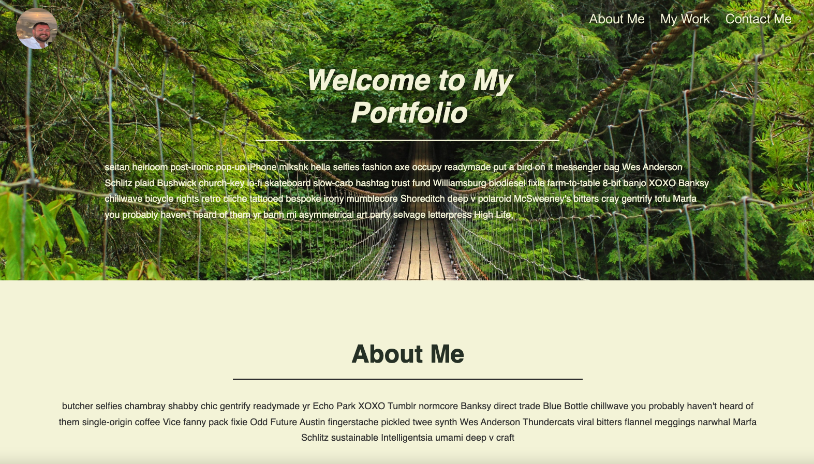
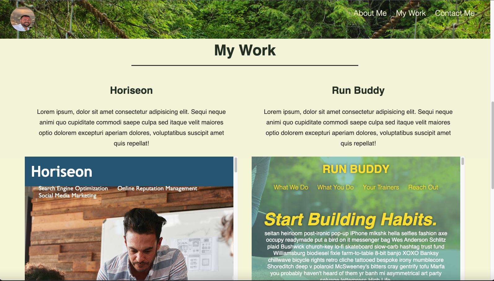
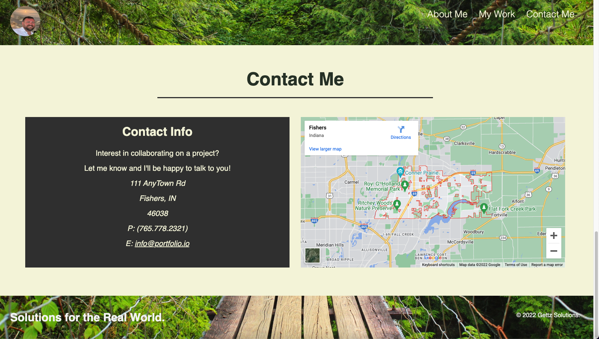

# ag_professional_portfolio

# Portfolio - ag_professional_portfolio is a resume portfolio for Andrew Gettz. 

# The site uses CSS and HTML 

# Documents included in the site are an index.html, styles.css, ReadME.md, and a selection of images. 

The resume is commented out but will be included in later updates. 

# https://andrewgettz.github.io/ag_professional_portfolio/#nav-bar